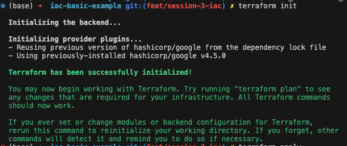
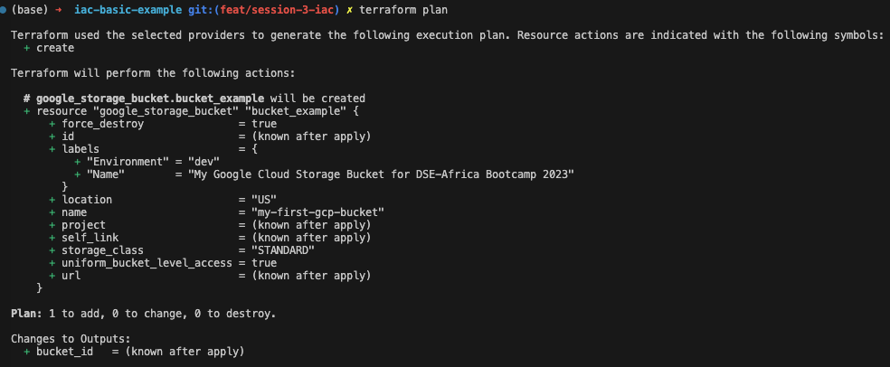
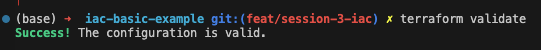
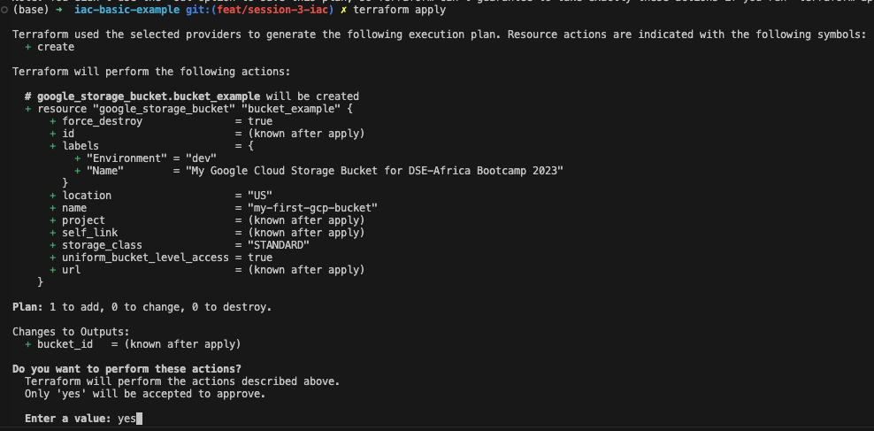

# Basic Google Cloud Storage Bucket deployment with Terraform

This repository contains a basic terraform files configuration to deploy a single bucket within Google Cloud Platform (GCP) using Cloud Storage service.

## Requirements

- [GCP account](https://console.cloud.google.com/) 
- Install [Terraform](https://developer.hashicorp.com/terraform/tutorials/aws-get-started/install-cli) `>= 1.4.6` required for this exercise
- [gcloud SDK](https://cloud.google.com/sdk/docs/install-sdk)
- The gcloud project must have the following APIs enabled:
   * `Cloud Storage`
- [Authenticating Terraform to access GCP](https://github.com/sassoftware/viya4-iac-gcp/blob/main/docs/user/TerraformGCPAuthentication.md#Terraform-project-variables-to-authenticate-with-GCP)
   *  For the roles to use, just apply `roles/storage.admin`

## Getting Started

After the previous requirements, follow these steps to deploy the Cloud Storage Bucket on GCP:

1. Clone this repository.

2. Go to the folder:
```bash
cd session_03/exercises/iac-basic-example
```

3. Export your service account as a environment variable. This Env Variable will be used as the main one to get the credentials for the GCP Account + Terraform.
```bash
export GOOGLE_APPLICATION_CREDENTIALS=YOUR-PATH-HERE.json
```

4. Create a file with the name `terraform.tfvars` with the same content as `example.tfvars` and modify the variables to your liking taking into account regions and zones with the [Free Tier](https://cloud.google.com/free).

5. Initialize Terraform
```bash
terraform init
```




6. Check the plan of the resources about to be created. Validate carefuly the configuration of the service and the outputs expected.
```bash
terraform plan
```



7. OPTIONAL - Validate the configuration file.
```bash
terraform validate
```



8. Apply the configuration and create the resources by typing `yes`
```bash
terraform apply
```



9. Finally don't forget to Destroy all the resources deployed. Type `yes`
```bash
terraform destroy
```


## Acknowledgments
This solution was based on these guides

   - [Use Terraform to create storage buckets and upload objects](https://cloud.google.com/storage/docs/terraform-create-bucket-upload-object)
   - [Get Started - Google Cloud](https://learn.hashicorp.com/collections/terraform/gcp-get-started) guide, containing Terraform configuration files to create resources on GCP.
   
Follow the step-by-step for another [GCP: Simple data pipeline](https://protective-opossum-8c5.notion.site/GCP-Simple-data-pipeline-2c02ea8ae6c64cd88813276787a3f551) basic deployment with other services included.
