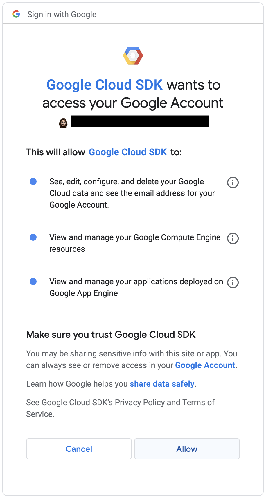
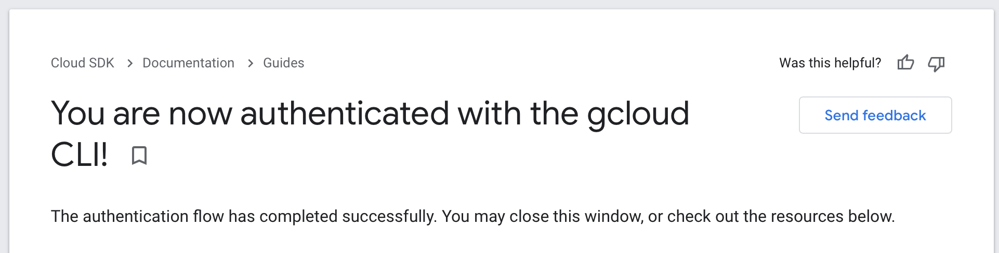
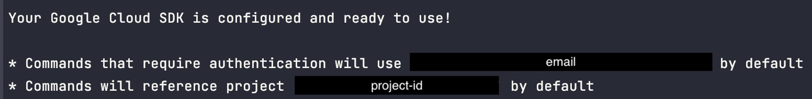
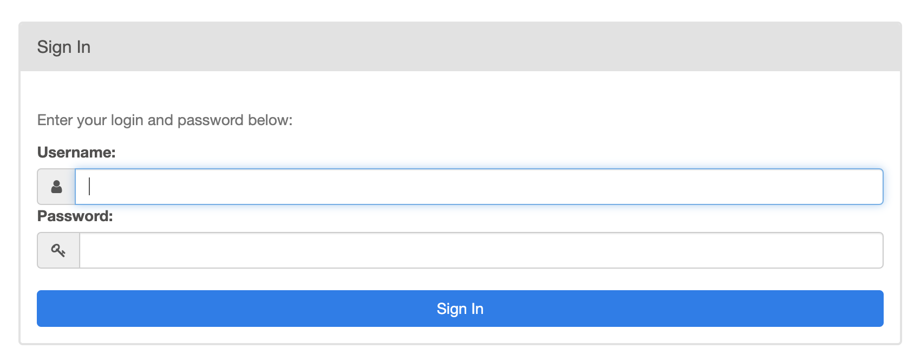
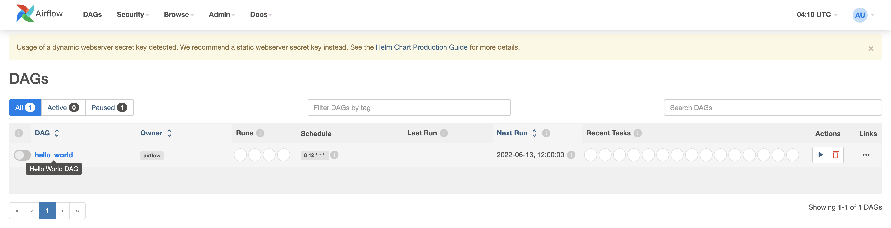

# Google Kubernetes Engine (GKE), Airflow and Terraform template


## Prerequisites
- [Configured GCP account](https://cloud.google.com/)
- [Homebrew](https://brew.sh/) (if you're using MacOS)
- [Kubectl cli](https://kubernetes.io/docs/tasks/tools/) (choose the OS you're working with)
- [gCloud SDK](https://cloud.google.com/sdk/docs/quickstart)
- [Terraform](https://learn.hashicorp.com/tutorials/terraform/install-cli) >= 0.13
- [Helm 3](https://helm.sh/docs/intro/install/)


## Step by step guide
1. Clone this repository.


2. Create a [virtual environment for your local project](https://medium.com/@dakota.lillie/an-introduction-to-virtual-environments-in-python-ce16cda92853)
and activate it:
    ```bash
    python3 -m venv .venv # create virtual environment
    source .venv/bin/activate # activate virtual environment
    deactivate # DO NOT RUN YET: deactivates virtual environment
    ```

3. Initialize gcloud SDK and authorize it to access GCP using your user account credentials:
    ```bash
    gcloud init
       
    # The next portion represents the cli settings setup
    >> [1] Re-initialize this configuration [default] with new settings # config to use
    >> [1] user@sample.com # account to perform operations for config
    >> [6] project-id # cloud project to use
    >> [8] us-central1-a # region to connect to
   
    gcloud auth application-default login # authorize access
    ```
   **DISCLAIMER:** This part will ask you to choose the Google account and the GCP project you will work with. It
will also ask you to choose a region to connect to. The information shown above in is an example of what you *can*
choose, but keep in mind that this was used for credentials that were already entered once before.  


3. For GCP to access you user account credentials for the first time, it will ask you to give it explicit permission
like so:




4. After choosing the Google account to work with and successfully granting permissions, you should be redirected to
    this message:



5. You should also see a similar message to this in your terminal:



7. In the GCP Console, enable:
   - Compute Engine API
   - Kubernetes Engine API


7. In your cloned local project, copy the [terraform.tfvars.example](./terraform.tfvars.example) and paste it in the
root of the project named as *terraform.tfvars*, changing the property *project_id* to your corresponding project ID.


8. Initialize the Terraform workspace and create the resources:
    ```bash
    terraform init # initialize
    terraform init --upgrade # if you initialized once before and need to update terraform config
    
    terraform apply --var-file=terraform.tfvars
    >> yes # lets terraform perform actions described
    ```
    ***IMPORTANT***: This process might take around 10-15 minutes, **be patient please**.


9. Set the kubectl context:
    ```bash
    gcloud container clusters get-credentials $(terraform output -raw kubernetes_cluster_name) --region $(terraform output -raw location)
    ```

10. To work with Airflow, create a NFS (Network File System) server:
     ```bash
     kubectl create namespace nfs # creates namespace
     kubectl -n nfs apply -f nfs/nfs-server.yaml # creates server
     export NFS_SERVER=$(kubectl -n nfs get service/nfs-server -o jsonpath="{.spec.clusterIP}")
     ```

11. Create a namespace for storage deployment:
     ```bash
     kubectl create namespace storage
     ```

12. Add the chart for the nfs-provisioner:
     ```bash
     helm repo add nfs-subdir-external-provisioner https://kubernetes-sigs.github.io/nfs-subdir-external-provisioner/
     ```

13. Install nfs-external-provisioner:
     ```bash
     helm install nfs-subdir-external-provisioner nfs-subdir-external-provisioner/nfs-subdir-external-provisioner \
     --namespace storage \
     --set nfs.server=$NFS_SERVER \
     --set nfs.path=/
     ```

14. Create a namespace for Airflow:
    ```bash
    kubectl create namespace airflow
    ```

15. Add the chart repository:
    ```bash
    helm repo add apache-airflow https://airflow.apache.org
    ```

16. Install the Airflow chart from the repository:
    ```bash
    helm upgrade --install airflow -f airflow-values.yaml apache-airflow/airflow --namespace airflow
    ```
    ***IMPORTANT***: This process might take around 5 minutes to execute, **be patient please**.


17. Verify that the pods are up and running:
    ```bash
    kubectl get pods -n airflow
    ```

18. Access the Airflow dashboard with what the Helm chart provided:
    ```bash
    Your release is named airflow.
    You can now access your dashboard(s) by executing the following command(s) and visiting the corresponding port at localhost in your browser:
    
    Airflow Webserver:     kubectl port-forward svc/airflow-webserver 8080:8080 --namespace airflow
    Default Webserver (Airflow UI) Login credentials:
        username: admin
        password: admin
    Default Postgres connection credentials:
        username: postgres
        password: postgres
        port: 5432
    ```
    **Note:** Sometimes there's an error when doing the kubectl portforward. If all of the pods are running, we might
    just need to keep trying.
    

19. Once in `localhost:8080`, you should see the Airflow login.



20. After logging in with your credentials (username and password from webserver in step 18), you should see the Airflow
dashboard.



## Don't forget to ***destroy everything*** after you're done using it!
- To destroy the cluster:
    ```bash
    terraform destroy --var-file=terraform.tfvars
    ```
- Double-check your GCP console to make sure everything was correctly destroyed.


## Troubleshooting
1. Cloud SQL instance already exists.
    > Error: Error, failed to create instance data-bootcamp: googleapi: Error 409 The Cloud SQL instance already exists. When you delete an instance, you can't reuse the name of the deleted instance until one week from the deletion date., instanceAlreadyExists
   
    ***Fix:*** In [terraform.tfvars](./terraform.tfvars), change the CloudSQL *instance_name* property to be named
differently:
    ```bash
    # CloudSQL
    instance_name = "data-bootcamp-2"
    ```

2. Root resource was present, but now absent.
    > Error: Provider produced inconsistent result after apply. When applying changes to
    > module.cloudsql.google_sql_user.users, provider "provider[\"registry.terraform.io/hashicorp/google\"]" produced an
    > unexpected new value: Root resource was present, but now absent.

    ***Fix:*** In [main.tf](./main.tf), set the terraform version to 3.77.0:
    ```bash
    terraform {
      required_providers {
        google = {
          source = "hashicorp/google"
          version = "3.77.0"
        }
      }
      required_version = ">= 0.13.0"
    }
    ```

3. Project not found.
    > ERROR: (gcloud.container.clusters.get-credentials) ResponseError: code=404, message=Not found: 
   > projects/gcp-data-eng-apprXX-XXXXXXXX/zones/us-central1-a/clusters/airflow-gke-data-apprenticeship.

    ***Fix:*** In [terraform.tfvars](./terraform.tfvars) the value of the property *project_id* might need to be changed
to match your project ID.


4. 403: Not Authorized.
    > Error: Error, failed to create instance data-bootcamp: googleapi: Error 403: The client is not authorized to make
   > this request., notAuthorized
   
    ***Fix:*** You might've skipped the `gcloud auth application-default login` command to authorize access.


5. Failed apache-airflow installation.
    > Error: INSTALLATION FAILED: failed to download "apache-airflow/airflow"
   
    This error can occur do to the `helm install airflow -f airflow-values.yaml apache-airflow/airflow --namespace airflow`
    command. ***Fix:***
    ```bash
    kubectl delete namespace airflow
    helm repo remove apache-airflow https://airflow.apache.org
    kubectl create namespace airflow
    helm repo add apache-airflow https://airflow.apache.org
    helm upgrade --install airflow -f airflow-values.yaml apache-airflow/airflow --namespace airflow
    ```

## Resources
1. [Airflow Documentation](https://airflow.apache.org/docs/apache-airflow/stable/)
2. [Terraform GCP Documentation](https://registry.terraform.io/providers/hashicorp/google/latest/docs)


## Acknowledgments
This solution was based on this guide: [Provision a GKE Cluster guide](https://learn.hashicorp.com/tutorials/terraform/gke?in=terraform/kubernetes),
containing Terraform configuration files to provision an GKE cluster on GCP.
