# Session 6 - Airflow: Database Ingestion

Welcome to a walkthrough of session 6. During the session, we carried out the following excercises.
It is listed as well an excercise number 2 with the aim to do it as optional or self-paced.

## 1. Load data into Postgres (Rest API -> Google Cloud Storage -> Cloud SQL [PostgresSQL])

The workflow can be seen on the following diagram:
<p align="center">
  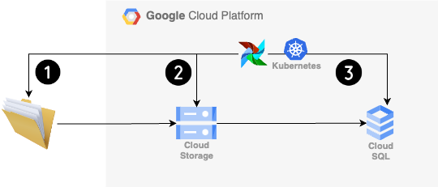
</p>

The diagram describes three principal flows to carry  out, all of these orchestrated by Airflow:

1. Download files from data sources locally. We will fetch the information from local APIs to local for our exercise.
2. Upload source files into GCS
3. Load the data into a Cloud SQL instance that hosts the Postgres database.


## Requeriments

1. Airflow deployment on GKE, you can choose the method of your preferences, in this case we will deploy Airflow on GKE based on [session 4](https://github.com/wizelineacademy/Google-Africa-DEB/tree/main/session_04/exercises/airflow-gke).

  Other options can be [session 2](https://github.com/wizelineacademy/Google-Africa-DEB/tree/main/session_02/exercises/airflow-helm-deployment) or [session 5](https://github.com/wizelineacademy/Google-Africa-DEB/tree/main/session_05/exercises/DEBootcamp-airflow)

2. Fetch the sources data files from Public API, this will be carried out by the DAG. We will use 2 sources:

 :+1:  [source 1: Warehouse and Retail Sales](https://data.montgomerycountymd.gov/Community-Recreation/Warehouse-and-Retail-Sales/v76h-r7br).

 :+1:  [source 2: Chart2000.com: Music Charts 2000 - 2023](https://chart2000.com/about.htm).

3. [Bucket created by Terraform](https://registry.terraform.io/providers/hashicorp/google/latest/docs/resources/storage_bucket). Check [session 3](https://github.com/wizelineacademy/Google-Africa-DEB/tree/main/session_03/exercises/iac-basic-example) for detailed explanation.

4. [Postgres database hosted on Cloud SQL](https://cloud.google.com/sql/docs/postgres/create-instance).

5. [DBeaver](https://dbeaver.io/) or [pgAdmin](https://www.pgadmin.org/) to query the data once loaded into the database.

## Step by step guide

1. Clone this repository.

2. Create a [virtual environment for your local project](https://medium.com/@dakota.lillie/an-introduction-to-virtual-environments-in-python-ce16cda92853)
and activate it:
    ```bash
    python3 -m venv .venv # create virtual environment
    source .venv/bin/activate # activate virtual environment
    deactivate # DO NOT RUN YET: deactivates virtual environment
    ```

3. Go to ./session_06/exercises/airflow-gke
```bash
    user@user-MacBook-Pro session_06 % cd exercises
    user@user-MacBook-Pro exercises % ls
    airflow-gke     exercises.md    storage-bucket
    user@user-MacBook-Pro exercises % cd airflow-gke
    user@user-MacBook-Pro airflow-gke % ls
    README.md                       imgs                            nfs                             terraform.tfstate               variables.tf
    airflow-values.yaml             main.tf                         outputs.tf                      terraform.tfstate.backup
    dags                            modules                         provider.tf                     terraform.tfvars.example
```

4. Once on folder **airflow-gke**, follow the instructions every instruction on [session 4](https://github.com/wizelineacademy/Google-Africa-DEB/tree/main/session_04/exercises/airflow-gke).

    For session 6, we need to modify 2 files with the aim to have Airflow running on GKE.

    - The first file is `terrafrom.tfvars.example`. On this file, modify the machines for GKE, by this way it will be prevented to have problems with pods eviction due to issues such as [Pod unschedulable](https://cloud.google.com/kubernetes-engine/docs/troubleshooting?&_ga=2.219127513.-1174351740.1694380242#PodUnschedulable).

```terraform
GKE
gke_num_nodes = 2
machine_type  = "n1-standard-2"
```

  - The second file is `airflow-values.yaml`. Here it is needed to separate the repo URL in two. The first part is the root and the second is the subPath.


```yaml
gitSync:
    enabled: true
    repo: https://github.com/wizelineacademy/Google-Africa-DEB
    branch: main
    rev: HEAD
    depth: 1
    # the number of consecutive failures allowed before aborting
    maxFailures: 0
    # subpath within the repo where dags are located
    # should be "" if dags are at repo root
    subPath: "/session_06/session_06/exercises/airflow-gke/dags"
```

With these modifications, we will have a working deployment of Airflow on GKE and health pods for the `namespace airflow`.

This is how it looks the Airflow UI:
<p align="center">
  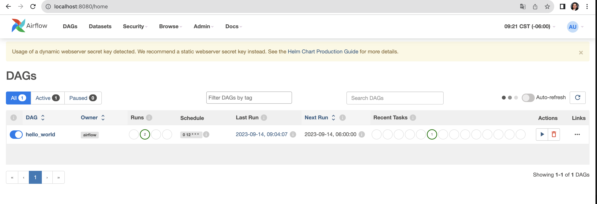
</p>

This is an overview of healthy pods associated to the worloads of `namespace airflow`:
<p align="center">
  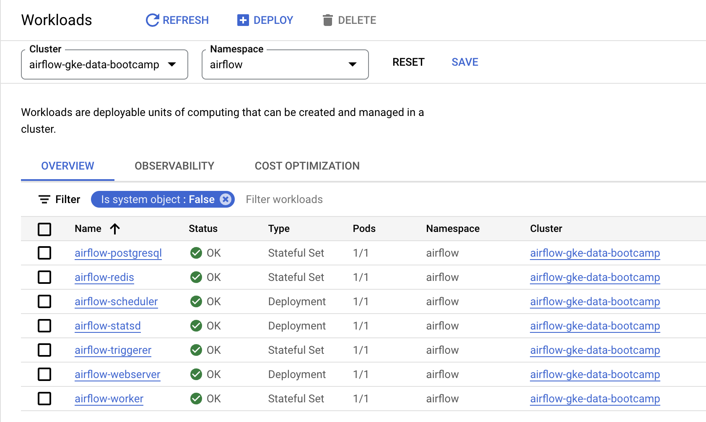
</p>

5. Once you had set Airflow on GKE, carry out to create a bucket by terraform:

> **Warning**<br>
It is recommended to create the bucket separate in another terminal.

 - Go to `./session_06/exercises/storage-bucket`

 - Review [session 3](https://github.com/wizelineacademy/Google-Africa-DEB/tree/main/session_03/exercises/iac-basic-example) to create the bucket.

 - Do not forget to modify `storage.tfvars.example` with the aim that the bucket get build on your project, region and zone of your choice.

6. After the bucket, a postgres database needs to be create it. 

- You can use the same instance that it is already running for Airflow infrastrcture. [Here is the link on how to create the database from GCP Console](https://cloud.google.com/sql/docs/postgres/create-manage-databases) and [user](https://cloud.google.com/sql/docs/postgres/users).

- This is how it can be created from console.
<p align="center">
  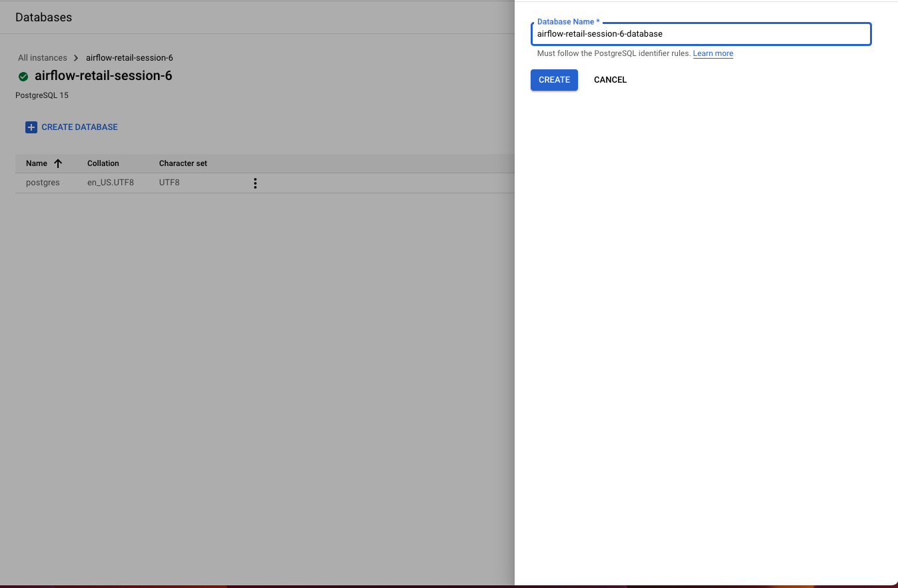
</p>

- Other option is to create a separate Cloud SQL instace created by terrafrom as in **session 4** or manually.

> **Warning**<br>
For demo pourpose a public instance was created, but the instance and database have to be private. Some options to access private instances are:

*  [Compute Engine VM](https://cloud.google.com/sql/docs/postgres/connect-instance-private-ip)

*  [Cloud SQL Auth Proxy](https://cloud.google.com/sql/docs/postgres/connect-instance-auth-proxy)

*  [GKE](https://cloud.google.com/sql/docs/postgres/connect-instance-kubernetes)


7. Before start with the DAGS, a **service account** is needed to create to establish connection with **Airflow**

- [Please review the following step by step to create connection for Google Cloud and Postgres](https://airflow.apache.org/docs/apache-airflow/1.10.1/howto/manage-connections.html)

- For Google, you will need to create a service account and download the **JSON Key**.

- The following video shows you two ways to do it:

[[](https://www.youtube.com/embed/UhYqag7Xjhw)


- **Googe Cloud Connection**

This are the parameters for the connection for GCP.

<p align="center">
  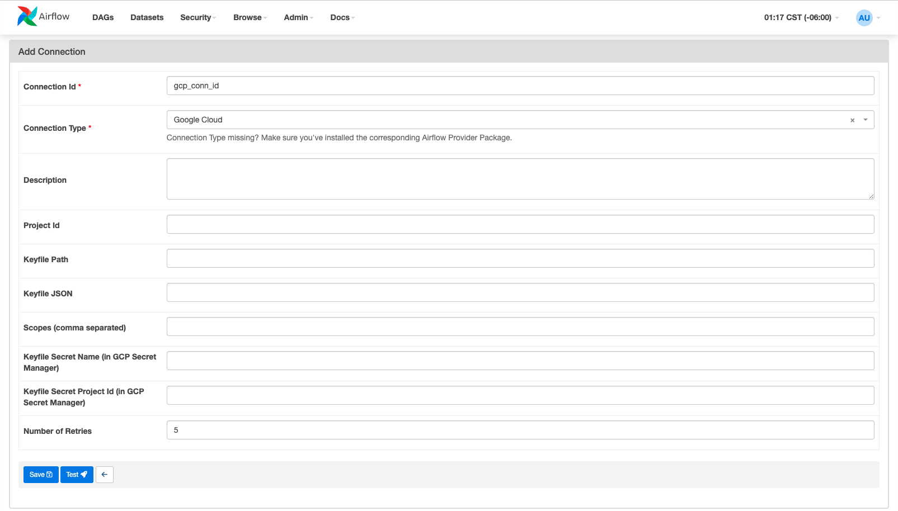
</p>

- For the connection to interconnect with Storage, it is important that the service account have the roles [Storage Admin and Storage Object Admin](https://cloud.google.com/storage/docs/access-control/iam-roles)

- For **Postgres** database these are the parameters:

<p align="center">
  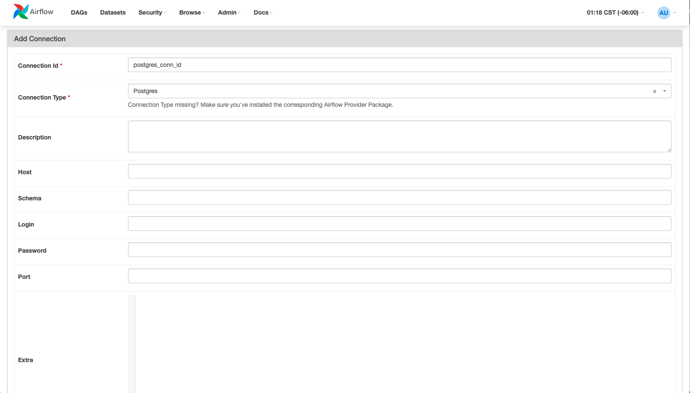

- **Connection ID**
- **Connection Type** : Postgres
- **Host**: Cloud SQL Public IP

<p align="center">
  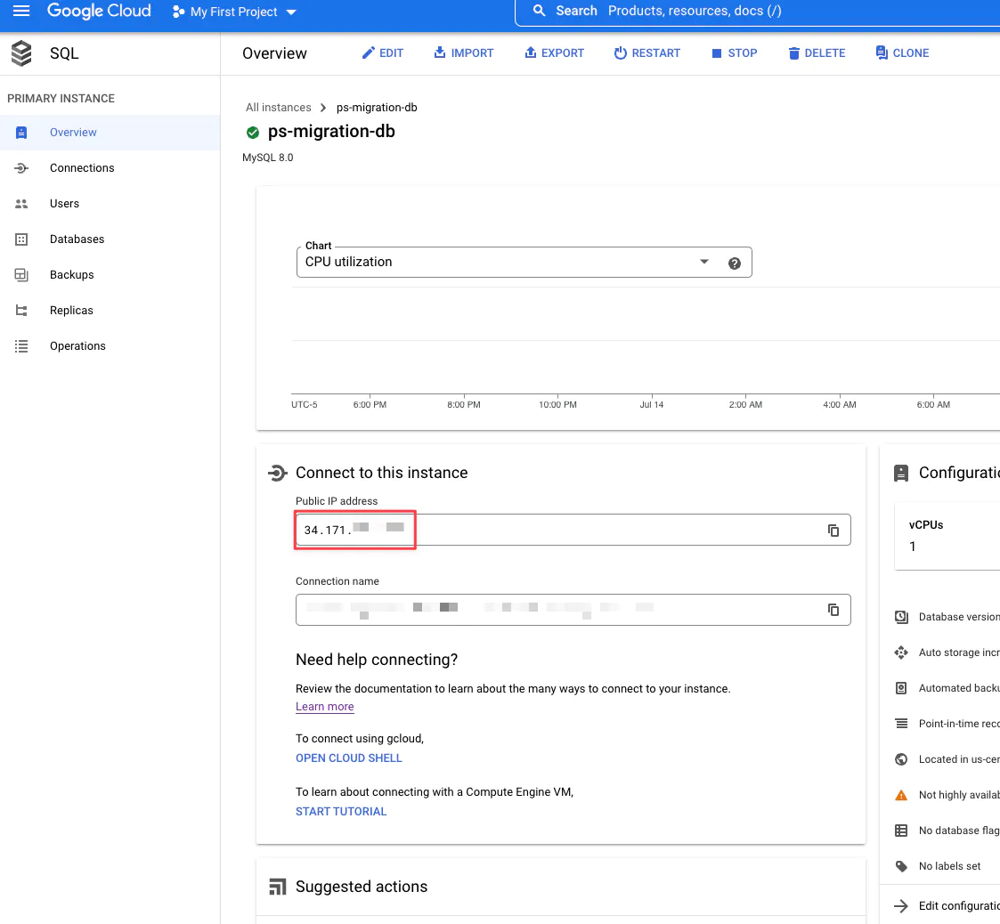

- **Schema** : Database name hosts in Cloud SQL
- **Login** : user you created to access the database
- **Password** : password to access
- **Port**: 5432

There are other options to create connections by CLI, environment variables, etc. [Here you can find more invormation](https://airflow.apache.org/docs/apache-airflow/stable/howto/connection.html)

8. On this momment, we can procede wiht the DAGs.

- You have 2 DAGS, [upload_to_gcs.py](https://github.com/wizelineacademy/Google-Africa-DEB/blob/main/session_06/exercises/airflow-gke/dags/upload_to_gcs.py)

This DAG fetch by Rest api the information and upload the data to GCS, review the code and notices the use of **GCSHook* to interact with GCP. The code fetch from only one source. Challenngue yourself and try to create a loop and modify the code fetch from more sources.

<p align="center">
  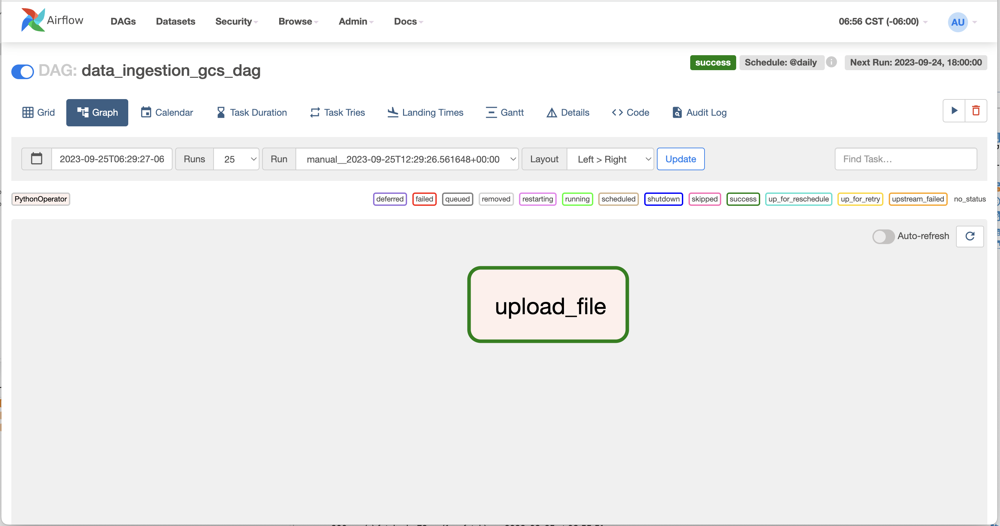

This is the final result:

<p align="center">
  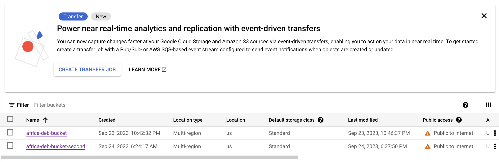

- Second DAG [ingest_from_gcs_to_postgres](https://github.com/wizelineacademy/Google-Africa-DEB/blob/main/session_06/exercises/airflow-gke/dags/ingest_from_gcs_to_postgres.py)

  - Verify the existence the data on the bucket
  - Create table
  - Validate data (Branching is use, review the record of the session and try to understand the condition for this)
  - Ingest data that can be visualize with DBeaver or Pgadmin

The flow looks like this:

<p align="center">
  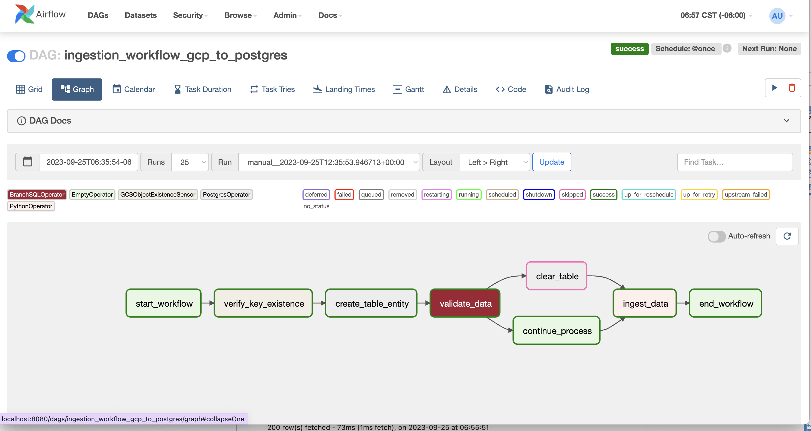

Final result after ingestion:

<p align="center">
  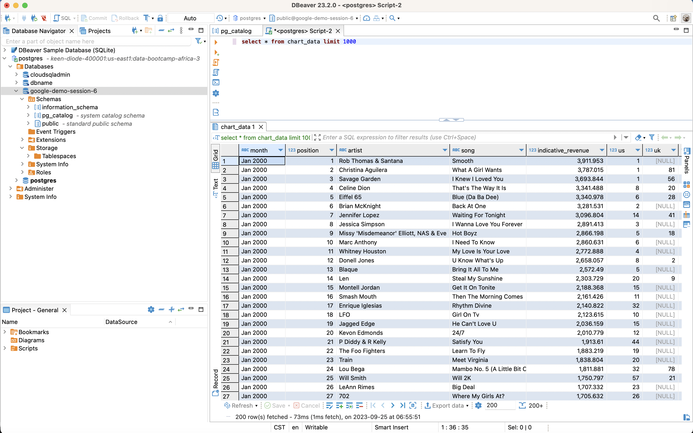

- Follow [this tutorial to create a connection with Dbeaver](https://dbeaver.com/docs/dbeaver/Create-Connection/)


